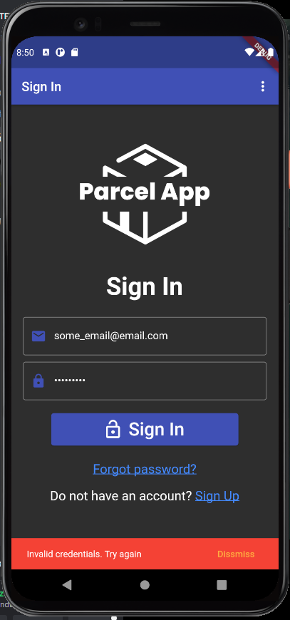

# Parcel App

Parcal App is an application which simulates working with parcel machine and sending or received packages. Also app allows to return packages. Parcel App delivers basic authentication and authorization. All these functionalities are delivered by Firebase and Firestore. App uses Bloc and Hydrated Bloc to manage and persist states. These libraries are used for packages, user state, returns, fonts, themes and language (Parcel App supports internationalization with Polish and English languages). Google Maps API is also included in an app for searching parcel machines. 

## Technologies, libraries and APIs

* Flutter
* Firebase
* Firestore
* Bloc
* HydratedBloc
* Google Maps API
* intl (Internationalization)
* Geolocator

## Overview

* ### Sign In, Sign Up, Sign Out, Forgot Password and validation
    First of widgets are Sign In and Sign Up widgets, presented in the images below: 

     
    
    
    User can toggle between both widgets by hitting Sign Up and Sign In text buttons.

    When form is not valid (I mean, in both widgets) there is specific info in each form fields. 
    
     
         

    Confirmation password field is not valid only when it's value is different than Password form field value.

    App includes proper messaging after different activities. For example, when user typed wrong credentials for his/her account, there is info about that:
    
        

    Also, if user tries to sign out with existing email:
    
     

    Scenario when account is created (app automatically navigates user to Sign In widget):
    
     

    Successful sign in operation navigates to Home widget with info about it:
    
     
    
    By hitting three dots in the right-up corner, there is a menu widget. When the user clicks "Sign out", the app navigates back to the Sign In widget with information about successful signing out.

     
     

    Another text button called "Forgot password?" navigates to a widget which enables the user to reset his/her password. This functionality is delivered by Firebase, same as Sign Up and Sign In.
    
    

* ### Send packages
    In Parcel App, a user is able to list sent package and send new one to another registered user. "Sent" item on a bottom bar navigates to a widget. By clicking Floating Action Button in the Sent Package widget, send package form shows up. 

     
     
    
    If the user wants to send a package, he/she must type correct information about the receiver, who must be signed up. If, at least, one of the first three fields is wrong, the package won't be created. Also, user cannot send a package to himself/herself. Example:

      

     About last two fields, which are: address of sender's parcel machine and address of receiver parcel machine. These addresses are delivered by Google Maps API. When the user clicks one of the field, the app navigates to Google Maps widget. There user can type searched address and Google Maps shows nearby parcel machines. These machines are not mocked up. There was a problem with searching them, because there is not any type regarded to parcel machines. That is why apps looks for objects with "Paczkomat" ("Parcel machine" in English) phrase in theirs names. Another problem was that apps can search parcel machines only within Poland. After choosing marker with search parcel machine and clicking Floating Action Button, the app navigates back to the form with parcel machine's address as value in the clicked form. 
    
     
     

    If payload is valid, package is created with navigation back to Sent Packages widget with info:

     

    Few things to clarify. Firstly, "Address track" button shows chosen sender's parcel machine on Maps. Secondly, "Non received" and "Received" tabs. "Non received" tab shows packages sent by user (sender) by not yet received by receiver. "Received" shows already received packages by receiver and those sent by user(sender).

    Obviously, user can delete his sent packages from history. He/she can delete single or multiple packages. Single delete can be done by hitting red button with delete icon. To delete multiple packages, the user has to click on the one of packages. Checkboxes with buttons show up. 

     

    First button from left deletes selected packages, middle one - selects all packages, right one - clears checkboxes and hides checkboxes with buttons. 

    When the user presses the button with selected packages, an alert confirmation dialog pops up. If the user chooses Cancel, no deleting is being process and the dialog disappears, but pressing button Delete, removes selected packages and navigates back to Sent Packages widget with correct information.

     
     

    * ### Receive packages

    Another item in Bottom Menu Bar is Receive Packages widget, example below:

     

    "Address track" button now shows address of receiver's parcel machine. 

    Here, user can receive his/her packages. He/she can do that by pressing the green button next to the given package. Then package is set as received and now will be seen in "Received" Tab Bar. Another way to accept packages, in this case multiple, is to use checkboxes, similar to deleting multiple packages. Now, in "Non received" Tab Bar, there is a new button, green one which accepts selected packages. Example:

     

    After successful accept:

    

    * ### Return packages
    
    First thing to say, return packages is a little different that previous functionalities. There is no action like accepting or deleting (I see that like actions which should be done by some kind of admin, some worker of parcel company). Rest functionalities of received packages are the same as sending packages. 

    Here is Return package widget with return form:

    
    

    Not all packages by any user can be returned. Firstly, the user who creates the return must be a receiver. Secondly, the package must be received. Last but not least, there must be a package with a given number. Below a few examples with mentioned exceptions:

    
    

    Types of returns:

    

    After successful return:

     

    * ### Edit profile
  
    Editing profile information about a user is very similar to signing up a new user. Below, there is a widget for editing a profile. Same rules are introduced as for signing up, such as a user cannot change the email to an existing one in app or a phone number cannot be 9 digits long. There is messaging in an edit widget:

     
     
       
    * ### Settings page
    
    Parcel App has settings page which is available via menu in app bar in, for instance, home widget or sign in/up widgets. Settings page looks like (user not authorized):

    
    
    Or (authorized):

    

    Delete button, of course, deletes the current sign in user, which dialog and messaging similar to a deleting packages. Example:

    
    
    
    Rest options in settings page cover functionalities like changing font size or switching themes and languages. Few examples shown below:

    
    
    
    
    
    
    
## Summary
That would be all the functionalities included in Parcel App. It is my first Flutter (or even mobile) app. There are still a lot of possible improvements like notification, calendar or unit testing. It might appear in the future. Any comments or feedback is appreciated! Cheers!
